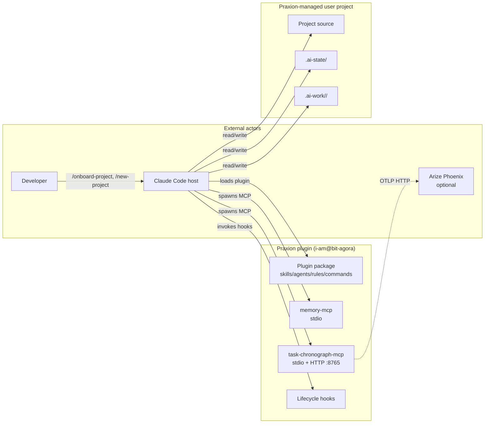
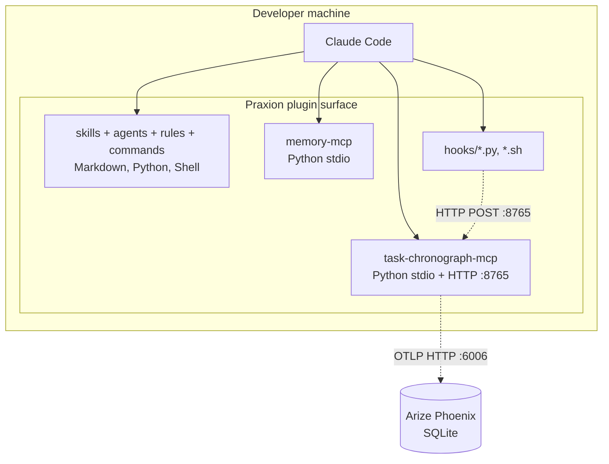

# System Deployment

<!-- Living deployment architecture document. Maintained by pipeline agents via section ownership.
     Created by systems-architect, updated by implementer/cicd-engineer, validated by verifier/sentinel.
     See skills/deployment/references/deployment-documentation.md for the full methodology. -->

## 1. Overview

<!-- OWNER: systems-architect | LAST UPDATED: 2026-05-03 by systems-architect (created during ai-training-onramp; established Praxion's own deployment surface plus a new "compute backend (taught)" section that documents what Praxion teaches projects about ML training compute lifecycle) -->

| Attribute | Value |
|-----------|-------|
| **System** | Praxion |
| **Primary runtime** | Claude Code plugin (npm package `i-am@bit-agora`) plus secondary targets for Claude Desktop and Cursor |
| **Deployment level** | Plugin distribution (npm + git clone) + per-project install scripts + lifecycle hooks |
| **Last verified** | 2026-05-03 by systems-architect (initial creation as part of ai-training-onramp) |

Praxion is a meta-project distributed as a Claude Code plugin. There is no traditional web/backend deployment topology (no Docker Compose, no reverse proxy, no databases): Praxion ships as Markdown skills/agents/rules/commands plus two Python MCP servers (memory-mcp, task-chronograph-mcp) launched on-demand by the Claude Code host. This document captures (a) Praxion's own deployment surface and (b) the **compute backend story Praxion teaches** for the ML/AI training archetype that landed in v1 of the ai-training-onramp work — a structural concept this document anchors so future ML-archetype refinements have a home.

## 2. System Context

<!-- OWNER: systems-architect | LAST UPDATED: 2026-05-03 by systems-architect -->
<!-- L0 diagram: system boundary + external actors. -->

> **Detail views:** [Service Topology](#3-service-topology)

### External Dependencies

| Dependency | Type | Strong/Weak | Shared SLO? | Notes |
|---|---|---|---|---|
| Claude Code | External (host) | Strong | No (host runtime) | Plugin cannot run without it |
| Python 3.13+ | External (runtime) | Strong | No | MCP server runtime; hooks |
| Git 2.x+ | External (runtime) | Strong | No | Worktree management, merge drivers |
| `uv` | External (tooling) | Weak | No | MCP server launch; Python project management |
| Arize Phoenix | External (observability) | Weak | No | Optional OTLP endpoint for traces; pipeline degrades gracefully without it |
| `chub` (context-hub) | External (knowledge) | Weak | No | Curated API docs; MCP and CLI; fallback to web/training data when absent |

### Compute backend (taught — for ML/AI training archetype)

This subsection documents the **compute backend story Praxion teaches** projects in the ML/AI training archetype. Praxion itself does not deploy training jobs; the project does. Praxion ships the conventions and the abstraction.

| Tier | Backend | Serves operational modes | Praxion ships in v1 | Reference |
|---|---|---|---|---|
| Default — local | `subprocess.run` semantics | Modes A (co-located on owned GPU) and B (co-located on rented GPU) | Yes — ~0 LOC | `skills/neo-cloud-abstraction/references/local-backend.md` (designed) |
| Default — remote | SkyPilot 0.12.1 (PyPI) | Mode C (Praxion separated) — covers 20+ providers | Yes — one adapter | `skills/neo-cloud-abstraction/references/skypilot-backend.md` (designed) |
| Specialization | RunPod direct via `@runpod/mcp-server` 1.1.0 (npm) | Mode C committed to RunPod | Yes — v1 reference recipe | `skills/neo-cloud-abstraction/references/runpod-direct-adapter.md` (designed) |
| Specialization (v2) | Lambda direct (REST), Crusoe direct (REST), CoreWeave direct (K8s) | Mode C committed to those providers | No — deferred | (v2 references) |

The contract — `training_job_descriptor` schema and 8 lifecycle operations — is invariant across modes. See `dec-118` for the full rationale and `.ai-state/ARCHITECTURE.md` Components/Interfaces sections for the schema.

## 3. Service Topology

<!-- OWNER: systems-architect (skeleton), implementer (as-built) | LAST UPDATED: 2026-05-03 by systems-architect (initial skeleton) -->

Praxion has no servers in the traditional deployment sense. Two stdio MCP servers launch per Claude Code session; one of them additionally serves an HTTP daemon on `localhost:8765` for hook event ingestion.

| Service | Image/Build | Ports (host:container) | Health Check | Restart Policy |
|---|---|---|---|---|
| memory-mcp | local Python via `uv run` | none (stdio only) | n/a (per-session lifecycle) | n/a |
| task-chronograph-mcp | local Python via `uv run` | `8765:8765` (HTTP daemon) | HTTP `GET /health` (informational) | n/a (per-session lifecycle) |

Praxion does not run as a long-lived service. MCP processes start when Claude Code spawns them and exit when the session ends.

## 4. Configuration

<!-- OWNER: implementer | LAST UPDATED: 2026-05-03 (skeleton — implementer fills in as-built configuration during pipeline) -->

### Environment Variables

| Variable | Required | Default | Description | Sensitive |
|---|---|---|---|---|
| `PRAXION_DISABLE_MEMORY_MCP` | No | unset | Skip memory persistence in this project | No |
| `PRAXION_DISABLE_CHRONOGRAPH_MCP` | No | unset | Skip span emission in this project | No |
| `PRAXION_INJECT_NATIVE_SUBAGENTS` | No | `0` | Inject Praxion-process preamble into Praxion-native subagents (default off) | No |
| `CHUB_TELEMETRY` | No | `0` | context-hub telemetry off by default | No |
| `CLAUDE_CODE_SUBAGENT_MODEL` | No | unset | Operator kill switch for subagent model routing | No |

### Compute backend env vars (taught)

| Variable | Required | Default | Description | Sensitive |
|---|---|---|---|---|
| `RUNPOD_API_KEY` | Yes (when using RunPod direct) | -- | RunPod API key for `@runpod/mcp-server` | Yes |
| SkyPilot config | Yes (when using SkyPilot) | -- | Provider-specific via `~/.aws/`, `~/.gcp/`, etc. (per SkyPilot conventions) | Yes |

### Secrets Management

Secrets are project-scoped, not Praxion-scoped. Praxion does not store credentials; it teaches projects to use `.env` patterns from the `deployment` skill's `references/secrets-management.md`. For ML training compute backends, secrets are passed through `subprocess.Popen` env (local), SkyPilot's per-cloud auth (default-remote), or the RunPod MCP server's `RUNPOD_API_KEY` (RunPod direct).

### Environment Differences

Praxion has no production/staging/dev split. It runs identically on every developer machine.

## 5. Deployment Process

<!-- OWNER: cicd-engineer | LAST UPDATED: 2026-05-03 (skeleton — cicd-engineer fills in as-deployed) -->

Praxion deployment is plugin distribution. Two paths:

1. **Marketplace install**: `claude plugin install i-am@bit-agora` (npm-backed)
2. **Clone + install script**: `git clone <repo> && ./install.sh code` (developer / contributor path)

Per-project onboarding via `/onboard-project` (existing project) or `/new-project` (greenfield) is post-install configuration, not deployment per se.

### CI/CD Integration

GitHub Actions for Praxion's own repo handle skill linting, hook tests, MCP server integration tests, version bumping (Commitizen), and changelog generation. Populated by cicd-engineer when relevant changes land.

## 6. Failure Analysis

<!-- OWNER: systems-architect | LAST UPDATED: 2026-05-03 by systems-architect (skeleton + ML training risks) -->

### Failure Mode Analysis

| Component | Risk | Likelihood | Impact / Mitigation | Outage Level |
|---|---|---|---|---|
| memory-mcp | MCP server crash | Low | Memory persistence breaks for current session; Claude Code surfaces error; restart MCP server. Hook gates protect against partial writes. | Degraded |
| task-chronograph-mcp HTTP daemon | Port 8765 conflict | Low | Hooks cannot post events; spans silently lost. Daemon restart resolves. | Degraded (observability only) |
| Hook script failure | Pre-commit hook bug | Low | Commit blocked; user fixes hook input or bypasses with `--no-verify` (discouraged) | Local only |
| ML compute backend (taught) — local | Wall-clock budget exceeded; runaway training process | Medium | `wall_clock_seconds_max` enforced via `signal.alarm` or equivalent in `/run-experiment` local backend | Per-experiment |
| ML compute backend (taught) — SkyPilot | SkyPilot YAML schema drift between v0.12 and a future major | Medium | Pin SkyPilot to `~=0.12` in skill body; sentinel staleness check on the skill | Skill-content currency |
| ML compute backend (taught) — RunPod direct | `@runpod/mcp-server` upstream maintenance lapse | Low | Reference is reference-only; abstraction's contract is what matters; v2 specializations are alternatives | Reference rotation |

### Dependency Classification

| Dependency | Type | Strong/Weak | Failure Impact |
|---|---|---|---|
| Claude Code | External (host) | Strong | Plugin does not run |
| Python 3.13+ | External (runtime) | Strong | MCP servers and hooks fail |
| Git 2.x+ | External (runtime) | Strong | Worktree, merge driver, ADR finalize all fail |
| Arize Phoenix | External (observability) | Weak | Spans not exported; pipeline continues |
| `chub` | External (knowledge) | Weak | API doc fetch falls back to web/training data |
| SkyPilot (taught) | External (taught backend) | Weak (project-side) | Project user installs and configures; Praxion teaches conventions |
| `@runpod/mcp-server` (taught) | External (taught backend) | Weak (project-side) | Same — project-side concern |

## 7. Monitoring & Observability

<!-- OWNER: systems-architect (skeleton); implementer fills in -->

### Health Checks

Praxion has no traditional health-check endpoints. The Chronograph MCP HTTP daemon serves `/health` for informational purposes. MCP server health is implicit in Claude Code's MCP lifecycle (failure surfaces in the host).

### Logging

| Service | Log Driver | Access |
|---|---|---|
| memory-mcp | stderr | Claude Code error log; per-session |
| task-chronograph-mcp | stderr | Claude Code error log; per-session |
| Hooks | stderr | Claude Code displays on hook block (exit 2) |

### Service Level Indicators (if defined)

Not applicable. Praxion has no user-facing SLOs; it is developer tooling running per-session.

## 8. Scaling

Not applicable. Praxion runs per-developer-session; scaling is a per-machine concern (Claude Code's responsibility).

For taught ML training compute, scaling guidance lives in `skills/deployment/references/gpu-compute-budgeting.md` (designed) and `skills/ml-training/SKILL.md` (designed) — covers GPU memory arithmetic, mixed precision, gradient accumulation tradeoffs, and the scale-up heuristics from autoresearch (5-minute experiment → full-scale decision).

## 9. Decisions

Deployment-relevant decisions are recorded as ADRs in [`.ai-state/decisions/`](decisions/). Quick cross-reference for ai-training-onramp:

| ADR | Decision | Impact on Deployment |
|---|---|---|
| [dec-118](decisions/118-ai-training-tiered-backend-strategy.md) | Tiered backend strategy for ML compute | Praxion teaches three backends; ships SkyPilot + local as defaults; RunPod direct as v1 reference specialization |
| [dec-116](decisions/116-ai-training-results-schema-owner.md) | `TRAINING_RESULTS.md` schema ownership | Skill-defined schema means deployment-doc fields above (compute backend env vars, FMA rows) reference the skill, not duplicated here |

Pre-existing dec-NNN entries continue to live in `DECISIONS_INDEX.md`; this section names only the deployment-relevant ai-training-onramp ADRs (dec-115..120 cover the full set).

## 10. Runbook Quick Reference

<!-- OWNER: implementer | LAST UPDATED: 2026-05-03 (skeleton — populated as runbook procedures emerge) -->

### Common Operations

| Task | Command |
|---|---|
| Install plugin (clone path) | `./install.sh code` |
| Install plugin (marketplace) | `claude plugin install i-am@bit-agora` |
| Onboard existing project | `/onboard-project` |
| Scaffold greenfield project | `/new-project` |
| Run experiment (taught) | `/run-experiment` (designed; available after ai-training-onramp lands) |
| Check experiment (taught) | `/check-experiment` (designed) |

### Troubleshooting

| Symptom | Check | Fix |
|---|---|---|
| MCP server fails to start | `which uv`, Python version | Ensure `uv` and Python 3.13+ are installed |
| Hook event lost | `lsof -i :8765` | Restart Chronograph MCP daemon |
| ADR draft not promoting | post-merge hook fired? | `scripts/finalize_adrs.py --merged` manually |
| Tech-debt ledger conflict | merge driver registered? | `git config --get merge.tech_debt_ledger.driver` |
| ML compute budget exceeded (taught) | training wall-clock vs `gpu_hours_budget` | Review `WIP.md` budget; the ledger's signal is informational; `/run-experiment` enforces hard cap |
