# Agents

Custom agents for specialized workflows — autonomous subprocesses that handle complex, multi-step tasks in a separate context. **Tool-agnostic:** compatible with **Claude Code** (plugin) and **Cursor** (via sub-agents-mcp). One repo, one set of agent definitions; each tool uses its own install (see main [README](../README.md)).

**In Cursor:** Run `./install.sh cursor` (or `make install-cursor`); the same agents are exposed via sub-agents-mcp. No extra config.

## Available Agents

### Software Development Crew

Fifteen agents that collaborate on software development tasks, each with a dedicated responsibility. They communicate through shared documents and can be invoked independently or in sequence. The context-engineer shadows the researcher and systems-architect stages when work involves context artifacts, producing a cumulative `CONTEXT_REVIEW.md` that flows forward to downstream stages. The interface-designer shadows the same two stages when a task involves a substantial interface surface (web UI, TUI/CLI, API, MCP tools), producing `INTERFACE_DESIGN.md` with design decisions, sketches, and architecture challenges for the orchestrator-mediated review loop. The doc-engineer runs in parallel with the implementer and test-engineer when the planner assigns documentation steps, and continues to operate at pipeline checkpoints. The sentinel operates independently as an on-demand ecosystem auditor whose reports any agent can consume. The implementer executes plan steps with skill-augmented coding. The verifier sits downstream as an optional quality gate. The skill-genesis agent harvests patterns from implementation learnings and proposes new artifacts (memory entries, rules, skills, agent definitions) for persistent curation.



| Agent | Description | Skills Used |
|-------|-------------|-------------|
| `promethean` | Analyzes project state, optionally consuming sentinel reports for health context, generates feature-level improvement ideas through dialog, writes `IDEA_PROPOSAL.md` for downstream agents and timestamped `IDEA_LEDGER_*.md` to `.ai-state/idea_ledgers/` | — |
| `researcher` | Explores codebases, gathers external documentation, evaluates alternatives, and distills findings into `RESEARCH_FINDINGS.md` | — |
| `systems-architect` | Evaluates trade-offs, assesses codebase readiness, and produces architectural decisions in `SYSTEMS_PLAN.md` | — |
| `implementation-planner` | Breaks architecture into incremental steps (`IMPLEMENTATION_PLAN.md`, `WIP.md`, `LEARNINGS.md`) and supervises execution | `software-planning` |
| `context-engineer` | Audits, architects, and optimizes context artifacts (CLAUDE.md, skills, rules, commands, agents); shadows researcher and systems-architect stages when work involves context artifacts, producing cumulative `CONTEXT_REVIEW.md`; collaborates with pipeline agents as domain expert; implements context artifacts directly or under planner supervision | `skill-crafting`, `rule-crafting`, `command-crafting`, `agent-crafting` |
| `interface-designer` | Interface-layer design specialist for web UI, TUI/CLI, REST/GraphQL/gRPC APIs, and MCP tool surfaces; shadows researcher and systems-architect stages when a task involves substantial interface work, producing `INTERFACE_DESIGN.md` with design decisions, sketches, and architecture challenges; registers objections via the orchestrator-mediated challenge loop; runs standalone interface design reviews | `web-ui-design`, `tui-design`, `agentic-interface-design`, `api-design-craft`, `api-design`, `external-api-docs` |
| `implementer` | Implements individual plan steps with skill-augmented coding, self-reviews against conventions, and reports completion. Supports sequential and parallel execution | `software-planning`, `code-review`, `refactoring`, `web-ui-design`, `tui-design`, `agentic-interface-design`, `api-design-craft` |
| `test-engineer` | Designs, writes, and refactors test suites with expert-level test strategy. Handles dedicated testing steps: complex test scenarios (property-based, contract, integration), test suite refactoring, and testing infrastructure. Operates at the same pipeline level as the implementer | `software-planning`, `code-review`, `refactoring` |
| `verifier` | Verifies completed implementation against acceptance criteria, coding conventions, and test coverage; produces `VERIFICATION_REPORT.md` with pass/fail/warn findings; runs interface design review (conditional on `INTERFACE_DESIGN.md` presence); classifies rework smell-clusters in Phase 12.5 and emits `REWORK_MANIFEST.md` when issues found | `code-review`, `web-ui-design`, `tui-design`, `agentic-interface-design`, `api-design-craft` |
| `architect-validator` | Per-PR and on-demand structural validator that verifies code↔DSL↔ADR triangle consistency; runs in two modes (`pre-merge` as CI gate, `on-demand` for local validation); produces `ARCHITECTURE_VALIDATION.md` with drift findings and appends `TECH_DEBT_LEDGER.md` rows on FAIL | `external-api-docs` |
| `doc-engineer` | Maintains project-facing documentation quality (README.md, catalogs, architecture docs, changelogs); runs in parallel with implementer and test-engineer on planner-assigned doc steps; validates cross-references, catalog completeness, naming consistency, writing quality, and visual-tone discipline (emoji/badge/color); loads `web-ui-design` on-demand for HTML share-outs and diagram-heavy docs | `doc-management`, `web-ui-design` |
| `sentinel` | Independent read-only ecosystem quality auditor scanning all context artifacts across ten dimensions (eight per-artifact + code health + ecosystem coherence as system-level composite); produces timestamped `SENTINEL_REPORT_*.md` (accumulates) and `SENTINEL_LOG.md` (historical metrics) in `.ai-state/sentinel_reports/` — any agent or user can consume its reports | — |
| `skill-genesis` | Post-implementation learning harvester that triages entries from `LEARNINGS.md` and `VERIFICATION_REPORT.md`, deduplicates patterns, proposes artifacts (memory entries, rules, skills, agent definitions) through interactive dialog, and produces `SKILL_GENESIS_REPORT.md` with artifact specifications ready for handoff | `skill-crafting`, `rule-crafting` |
| `cicd-engineer` | Designs, writes, reviews, and debugs CI/CD pipelines with deep GitHub Actions expertise; creates workflows, optimizes pipelines, hardens security, configures caching, sets up deployment automation, troubleshoots failures, and reviews configuration for best practices | `cicd` |
| `roadmap-cartographer` | Runs an ultra-in-depth project audit (deterministic, agentic, or hybrid) through a **project-derived lens set** (drawn from project values + domain constraints + exemplar sets: SPIRIT, DORA, SPACE, FAIR, CNCF Platform Maturity, or Custom), orchestrates one researcher per lens in parallel, synthesizes findings into a 10-section `ROADMAP.md` covering both deficit repairs (Weaknesses) and **forward lines of work** (Opportunities — new capabilities, strategic bets, evolution trends), and emits it at the project root; activated by `/roadmap` or by phrases like "spring cleaning" and "state of the project" | `roadmap-synthesis` |

For a step-by-step tutorial showing how to drive the pipeline from ideation to verification, see [docs/getting-started.md](../docs/getting-started.md).

### Loop Participation

The forward pipeline (promethean → researcher → architect → planner → implementer/test-engineer/doc-engineer → verifier) is no longer a straight line — two feedback edges close it into a graph. The **CIS loop** is forward-feeding (researcher surfaces opportunity → architect dispositions); the **rework loop** is backward-feeding (verifier emits manifest → main agent spawns rework worktree → architect-first dispatch). Both share a single disposition vocabulary defined in [`skills/software-planning/references/disposition-vocabulary.md`](../skills/software-planning/references/disposition-vocabulary.md). For full loop semantics, data flows, and diagrams see [`docs/architecture.md` §10](../docs/architecture.md#10-pipeline-feedback-loops).

| Agent | Forward pipeline role | Loop participation |
|-------|----------------------|---------------------|
| `promethean` | Project-state ideation | — |
| `researcher` | Codebase + external research | **Sources CIS** — Hat 2 obligation surfaces strictly-better libraries/frameworks into `RESEARCH_FINDINGS.md § Continuous Improvement Signals` |
| `systems-architect` | Trade-off analysis, design | **Dispositions CIS** (Phase 7 — `switch-now` / `defer-with-rationale` / `dismiss-with-rationale`); **always-first on rework** — `/resume-rework` routes here so every rework cluster produces a `SYSTEMS_PLAN.md` the planner can consume (preserves the planner's input-shape invariant for implementation-class clusters) |
| `implementation-planner` | Step decomposition, supervision | Consumes architect's `SYSTEMS_PLAN.md` for implementation-class rework clusters |
| `context-engineer` | Context-artifact domain expertise | Shadows researcher + architect stages when context artifacts are touched |
| `interface-designer` | Interface-layer design specialist | Shadows researcher + architect stages when interface surface is in scope; orchestrator-mediated **challenge loop** with architect via `## Architecture Challenges` |
| `implementer` | Step execution with self-review | — |
| `test-engineer` | Dedicated testing | — |
| `doc-engineer` | Documentation quality | Parallel with implementer + test-engineer on planner-assigned doc steps |
| `verifier` | Quality gate against acceptance criteria | **Initiates rework loop** — Phase 12.5 clusters FAIL/WARN findings into `REWORK_MANIFEST.md` rows |
| `architect-validator` | Per-PR structural validator (code↔DSL↔ADR) | Independent — not in any pipeline edge |
| `sentinel` | Read-only ecosystem auditor | Independent — not in any pipeline edge |
| `skill-genesis` | Learning harvester | Post-pipeline — consumes `LEARNINGS.md` and `VERIFICATION_REPORT.md` after closure |
| `cicd-engineer` | CI/CD pipeline authoring | Forward pipeline only; no loop participation |
| `roadmap-cartographer` | Project audit-to-roadmap synthesis | Independent — on-demand via `/roadmap` |

## How Agents Work

Agents are **delegated, not invoked**. Claude decides when to spawn an agent based on the task at hand and the agent's `description` field. Unlike skills and commands, agents don't have a `/slash-command` syntax.

- Each agent runs in its own context window with its own tool permissions
- Agents cannot spawn other agents
- Skills listed in the agent's `skills` field are injected into its context (agents do not inherit skills from the parent)
- Foreground agents block the main conversation; background agents run concurrently

## Using Agents

### In conversation (recommended)

Ask Claude directly — it delegates based on the agent's description:

```
"Use the researcher agent to investigate authentication libraries"
"Run the systems-architect to design the new API layer"
```

### `/agents` command

List all available agents (built-in, user, project, and plugin):

```
/agents
```

### `--agent` flag (run as main thread)

Run Claude *as* a specific agent for the entire session. This makes the agent the main thread, not a delegated subagent — useful for headless or scripted runs:

```bash
claude --agent i-am:researcher -p "investigate X"
```

### `--agents` JSON flag (session-only overrides)

Define or override agents dynamically for a single session:

```bash
claude --agents '{
  "researcher": {
    "description": "Research specialist",
    "prompt": "You are a researcher...",
    "tools": ["Read", "Grep", "Glob", "Bash", "WebSearch", "WebFetch"],
    "skills": ["python-development"]
  }
}'
```

### Priority order

When multiple agents share the same name, higher priority wins:

| Location | Priority |
|----------|----------|
| `--agents` CLI flag | 1 (highest) |
| `.claude/agents/` (project) | 2 |
| `~/.claude/agents/` (user) | 3 |
| Plugin `agents/` | 4 (lowest) |

## Plugin Registration

Agents require explicit file paths in `plugin.json` (directory wildcards are not supported):

```json
"agents": [
  "./agents/promethean.md",
  "./agents/researcher.md",
  "./agents/systems-architect.md",
  "./agents/implementation-planner.md",
  "./agents/context-engineer.md",
  "./agents/interface-designer.md",
  "./agents/doc-engineer.md",
  "./agents/verifier.md",
  "./agents/implementer.md",
  "./agents/test-engineer.md",
  "./agents/sentinel.md",
  "./agents/skill-genesis.md",
  "./agents/cicd-engineer.md",
  "./agents/roadmap-cartographer.md",
  "./agents/architect-validator.md"
]
```

---

For creating custom agents, see the `agent-crafting` skill documentation.
