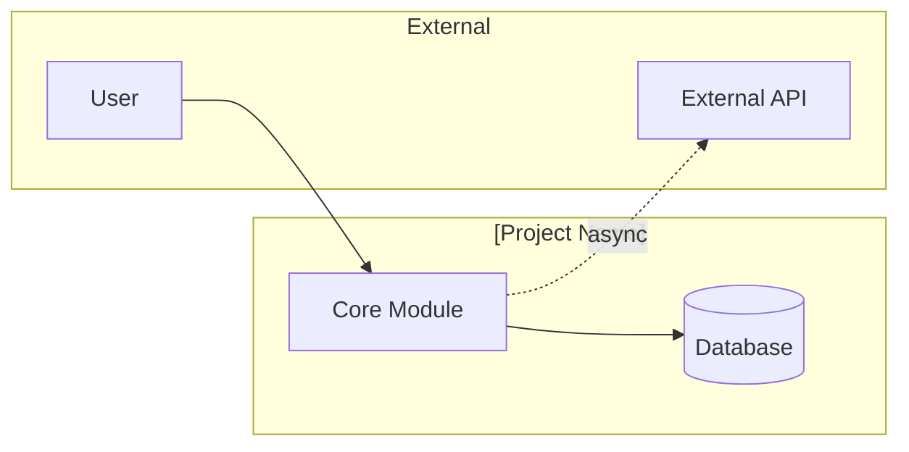
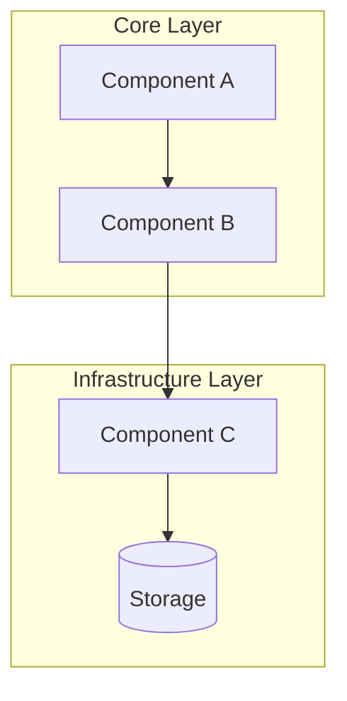
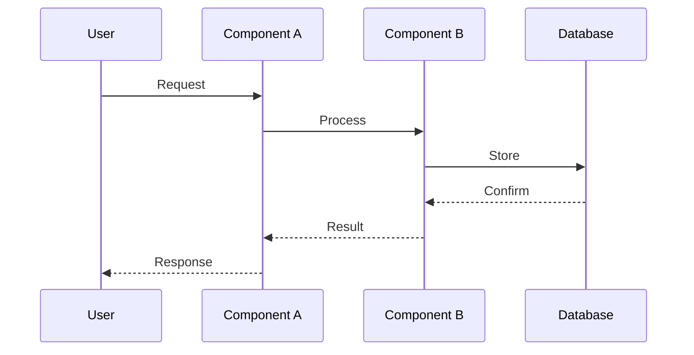

# Architecture Guide

<!-- Developer navigation guide. Every component name and file path in this document has been
     verified against the codebase. Only components that exist on disk are included.
     For design rationale, planned components, and architectural evolution, see .ai-state/ARCHITECTURE.md.
     Maintained by pipeline agents: created by systems-architect, updated by implementer,
     verified by doc-engineer at pipeline checkpoints.
     See skills/software-planning/references/architecture-documentation.md for the full methodology. -->

## 1. Overview

| Attribute | Value |
|-----------|-------|
| **System** | [Project name] |
| **Type** | [e.g., Web application, CLI tool, Library, API service] |
| **Language / Framework** | [e.g., Python 3.13 / FastAPI] |
| **Architecture pattern** | [e.g., Layered, Hexagonal, Microservices, Monolith] |
| **Last verified against code** | [YYYY-MM-DD] |

[One paragraph describing the system's purpose and high-level architectural approach.]

## 2. System Context

<!-- L0 diagram: system boundary + external actors/dependencies. Max 6-8 elements.
     Shows WHAT interacts with the system, not internals.
     Node shapes: rectangles for components, [(Database)] for storage, ([Queue]) for messaging.
     Only include integrations that exist in the current codebase. -->

> **Component detail:** [Components](#3-components)

## 3. Components

<!-- L1 diagram: major building blocks and their relationships. Max 10-12 nodes.
     Use subgraphs for logical boundaries (layers, bounded contexts).
     Solid arrows for direct dependencies, dotted for async/event-based.
     Every component listed here MUST exist on disk -- verify with ls/Glob before including. -->

| Component | Responsibility | Key Files |
|-----------|---------------|-----------|
| [Component A] | [What it does] | `src/component_a/` |
| [Component B] | [What it does] | `src/component_b/` |
| [Component C] | [What it does] | `src/component_c/` |

## 4. Interfaces

<!-- Key APIs, contracts, and integration points between components.
     Only include interfaces that are implemented and callable.
     Focus on boundaries that other components or external systems depend on. -->

| Interface | Type | Provider | Consumer(s) | Contract |
|-----------|------|----------|-------------|----------|
| [e.g., REST API] | HTTP | [Component A] | [External clients] | [e.g., OpenAPI spec at docs/api.yaml] |
| [e.g., Event bus] | Async | [Component B] | [Component C] | [e.g., JSON schema at schemas/events/] |

## 5. Data Flow

<!-- How data moves through the system for key scenarios.
     Use sequence diagrams for request flows, flowcharts for data pipelines.
     Focus on the 2-3 most important scenarios, not exhaustive coverage.
     Only describe flows that exist in the current codebase. -->

### [Primary Scenario Name]

## 6. Dependencies

<!-- External dependencies the system relies on.
     Verify against pyproject.toml, package.json, or equivalent before including.
     Only list dependencies that are currently installed and used. -->

| Dependency | Version | Purpose | Criticality |
|-----------|---------|---------|-------------|
| [e.g., PostgreSQL] | [17.x] | [Primary data store] | Critical |
| [e.g., Redis] | [7.x] | [Caching layer] | Non-critical (degrades gracefully) |

## 7. Constraints

<!-- Known limitations that affect developers working in this codebase.
     Type: Performance, Security, Compatibility, Regulatory, Technical, Quality. -->

| Constraint | Type | Rationale |
|-----------|------|-----------|
| [e.g., Response time < 200ms for API endpoints] | Performance | [User experience requirement] |
| [e.g., Must run on Python 3.11+] | Compatibility | [Minimum supported runtime] |
| [e.g., All data at rest must be encrypted] | Security | [Compliance requirement] |

## 8. Decisions

<!-- Architectural decisions are recorded as ADRs in .ai-state/decisions/.
     This section provides quick cross-references to decisions that shaped the architecture.
     Never duplicate ADR rationale here -- just link. -->

<!-- Template placeholder below uses NNN-slug convention (user fills in real ADR path) — suppressed from validator. -->
| ADR | Decision | Impact on Architecture |
|-----|----------|----------------------|
| [dec-NNN](../.ai-state/decisions/NNN-slug.md) | [Decision title] | [How it shapes the architecture] | <!-- validate-references:ignore -->

[Add new rows as architecture-related ADRs are created.]
